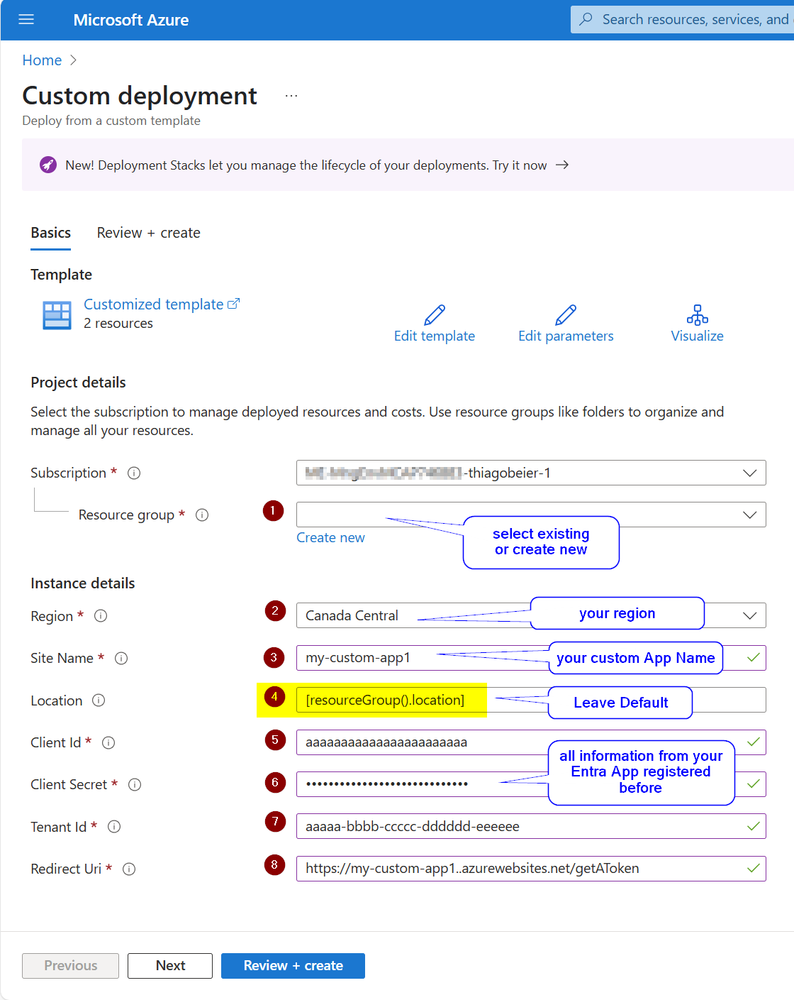
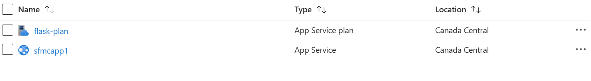

_Before Proceeding, make sure you have coreved the following:_

- Entra App information (Unique - One per each Application you're about to deploy: App ID, Tenant ID, Secret)

_Click Here to Deploy Web Apps to Azure_

Make sure to validate if you are creating New Resource Group (click on Create New) or select existing.

_When Web App is up and running check the following:_

- Web App main URL

_Alternate deployment_

az deployment group create --resource-group <resource-group-name> --template-uri https://raw.githubusercontent.com/thiagogbeier/flask_azure_app/main/azuredeploy.json --parameters siteName=myuniquesite123 clientId=xxxxx clientSecret=xxxxx tenantId=xxxxx

_Web App expected outcome_

